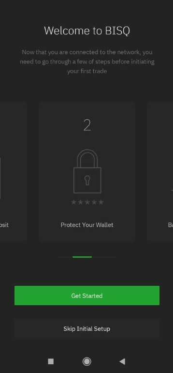
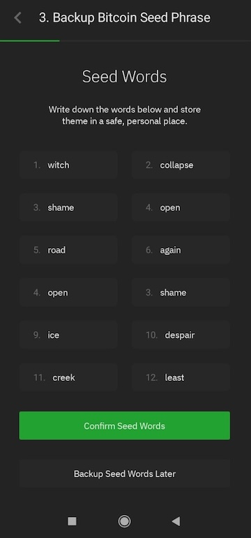
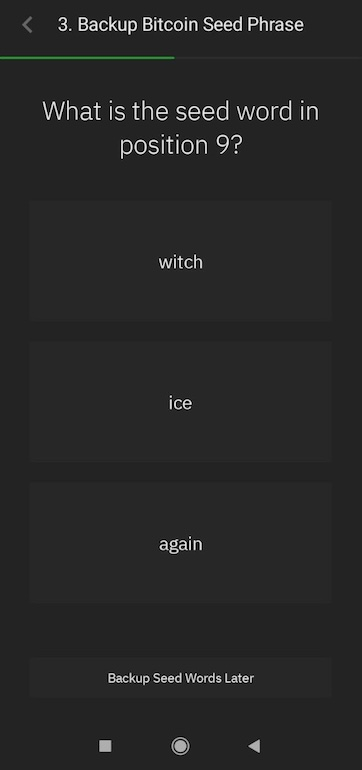
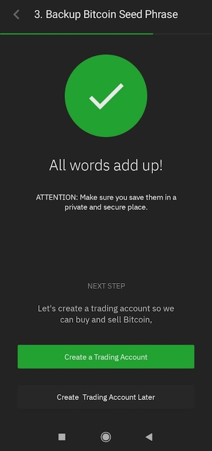

# BISQ Easy Mobile - UI Implementation

This is just a UI implementation with no functionality, covering following screens:
1. Splash screen
2. Welcome screen (with sliders)
3. Wallet creation / backup

Notes:
1. Kotlin code quality, Compose UI design patterns and best practices have loads of room to be improved.

## Video walkthrough
Download [here](preview/video-demo.mp4)

## Screens

